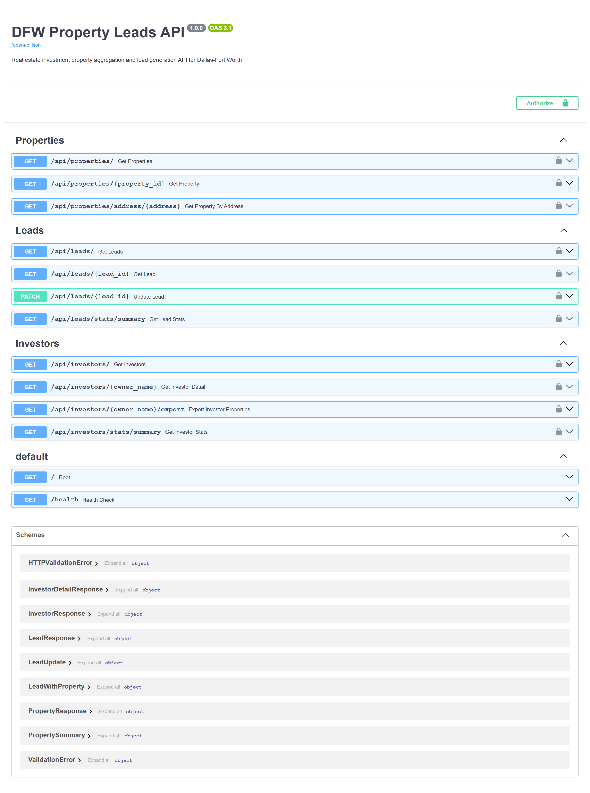

# property-leads-api
=======
A REST API for the DFW real estate market. It pulls county appraisal data for Dallas and Collin County, estimates equity on each property, and scores leads by how likely the owner is to sell.


>>>>>>> 3173ea124436bf5d2bf5c373451f93ae38f950f9

## What it does

<<<<<<< HEAD
County appraisal districts publish property data as CSV exports. This API reads those files, joins them by account number, and loads the results into PostgreSQL. From there, an equity calculator estimates remaining mortgage balance (using last sale price and year built) and flags high-equity properties as leads. A separate investor finder identifies properties held by LLCs and non-owner-occupied addresses.

Three API routers:

- `/api/properties` — query the full property database with filters
- `/api/leads` — list high-equity leads, get by ID, patch status and notes, and pull a summary aggregation
- `/api/investors` — investor-owned property lookup

## Tech stack

- Python 3.10+, FastAPI, uvicorn
- SQLAlchemy + psycopg2 (PostgreSQL)
- Docker Compose
- County CSV files as the data source (Dallas and Collin County)

## Running locally

**Step 1:** Download the county CSV files per the instructions in `DATA_SETUP.md`. You need `Account_Info.csv`, `Account_Appraisal_Year.csv`, and `Res_Detail.csv` from Dallas County.

**Step 2:** Set up your environment:

```bash
git clone https://github.com/yhafid1/property-leads-api.git
cd property-leads-api
cp .env.example .env
# fill in your DATABASE_URL
docker compose up --build
```

The API starts at `http://localhost:8000`. Interactive docs are at `/docs`.

**Step 3:** Run the scrapers to populate the database:

```bash
docker compose exec api python -m app.scrapers.dallas_scraper
docker compose exec api python -m app.scrapers.collin_scraper
```

**Without Docker:**

```bash
pip install -r requirements.txt
uvicorn app.main:app --reload
```

## Data model
=======
- Property data aggregation from Dallas and Collin County appraisal districts
- Equity calculation with mortgage estimation, plus a motivation score for ranking leads
- Investor-portfolio lookup (properties grouped by owner)
- API key auth and per-key rate limiting on every endpoint
- Lead status tracking and notes

## Tech stack

FastAPI, SQLAlchemy, PostgreSQL, Redis (rate limiting), Celery

## Setup

```bash
python -m pip install -r requirements.txt
docker-compose up -d          # Postgres + Redis
cp .env.example .env          # defaults work for local dev
uvicorn app.main:app --reload
```

API: `http://localhost:8000` | Docs: `http://localhost:8000/docs` | Health: `http://localhost:8000/health`

To populate the database with real property data, see `DATA_SETUP.md` for downloading county CSV files.

## Authentication

Every `/api/*` route requires an `X-API-Key` header matching a key from the `API_KEYS` env var (comma-separated for multiple keys). Generate one with:

```bash
python -c "import secrets; print(secrets.token_urlsafe(32))"
```

Requests are also rate-limited (60/min per key by default, set via `RATE_LIMIT_PER_MINUTE`). The limiter uses Redis when it's reachable and falls back to in-memory tracking if not.

```bash
# no key -> 401
curl http://localhost:8000/api/leads/

# valid key -> 200
curl -H "X-API-Key: your-key-here" http://localhost:8000/api/leads/
```

CORS is restricted to an allowlist via `ALLOWED_ORIGINS` (comma-separated, no wildcard).
>>>>>>> 3173ea124436bf5d2bf5c373451f93ae38f950f9

The `properties` table has 15 fields including assessed value, market value, last sale price, last sale date, owner name, and square footage. The `leads` table adds equity score, status (new/contacted/qualified/closed), and notes. Each lead record links back to its source property.

<<<<<<< HEAD
## The problem it solves

Real estate wholesalers in DFW spend hours manually pulling public records and cross-referencing spreadsheets to find motivated sellers. The goal is to automate the data collection and scoring so you can filter a 100,000-property dataset down to 50 high-equity leads in seconds.
=======
**Properties**
- `GET /api/properties/`: list properties
- `GET /api/properties/{id}`: get by ID
- `GET /api/properties/address/{address}`: get by address

**Leads**
- `GET /api/leads/`: list high-equity leads
- `GET /api/leads/{id}`: get by ID
- `PATCH /api/leads/{id}`: update status/notes
- `GET /api/leads/stats/summary`: lead stats

**Investors**
- `GET /api/investors/`: properties grouped by owner
- `GET /api/investors/{owner_name}`: one investor's portfolio
- `GET /api/investors/{owner_name}/export`: export as CSV
- `GET /api/investors/stats/summary`: investor stats

## License

MIT
>>>>>>> 3173ea124436bf5d2bf5c373451f93ae38f950f9
